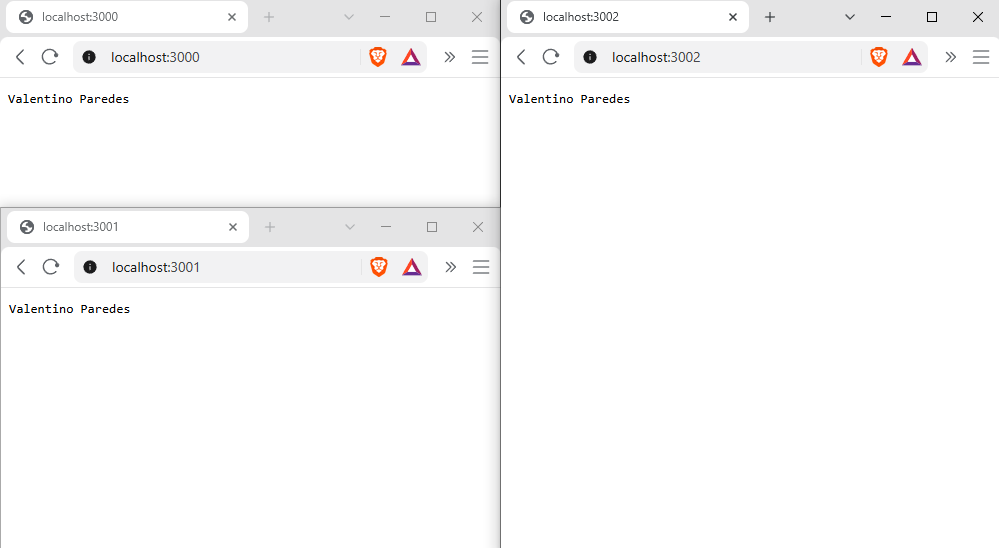
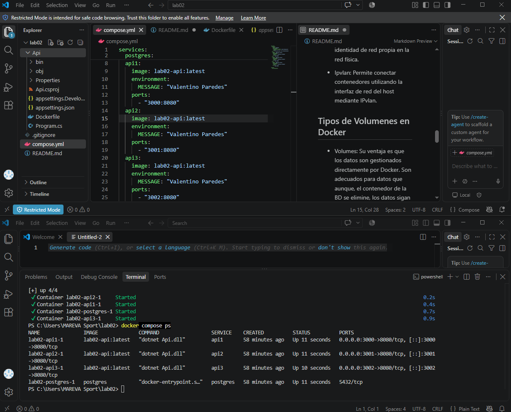
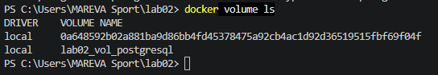
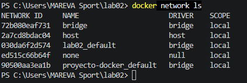

# Laboratorio 02
Ejercicio Docker Compose

## Stack

### API
- Minimal API implementada con .NET.
- El MESSAGE contiene mi nombre como Variable de Entorno.
- Docker.
- 3 copias de una API build local.

### Base de Datos
- PostgreSQL
- Se ejecuta como un servicio dentro de Docker Compose.
- Utiliza una variable de entorno para configurar la contraseña.
- Sus datos se almacenan mediante un volumen de Docker para que no dependan solamente del contenedor.


# Detalles

## Comandos
Para levantar todos los servicios o toda la arquitectura del compose.yml automáticamente se utiliza este comando:

```bash
docker compose up -d
```

Las tres copias de la API están disponibles en diferentes puertos:

- API 1: http://localhost:3000

- API 2: http://localhost:3001

- API 3: http://localhost:3002

Las tres utilizan la misma imagen de la API, pero funcionan como contenedores independientes.

## Configuración por entorno
La API utiliza la variable MESSAGE para mostrar el nombre configurado:

```
MESSAGE=Valentino Paredes
```

PostgreSQL también utiliza una variable de entorno reconocida para establecer su contraseña:

POSTGRES_PASSWORD=mysecretpassword

## Volumenes

Se utiliza el volumen nombrado como:

vol_postgresql

Está explicado más adeltante.

## Tipos de Redes en Docker
- Bridge: Es una red que permite que los contenedores conectados puedan comunicarse entre sí. En este proyecto Docker Compose crea automáticamente una red de este tipo para los servicios.

- Host: El contenedor utiliza directamente la red del equipo anfitrión.

- None: El contenedor no tiene conectividad de red.

- Overlay: Permite conectar contenedores entre diferentes hosts Docker.

- Macvlan: Permite que un contenedor tenga una identidad de red propia en la red física.

- Ipvlan: Permite conectar contenedores utilizando la interfaz de red del host mediante IPvlan.

## Tipos de Volumenes en Docker

- Volumes: Su ventaja es que los datos son gestionados directamente por Docker.
Son adecuados para datos que aunque, el contenedor de la BD se elimine, los datos sigan existiendo. No queremos que los datos sean temporales, no es lo ideal en este caso.
Es el método que fue usado en este ejercicio.

- Bind mounts: No fue necesario en este proyecto porque no necesitábamos compartir una carpeta de Windows con PostgreSQL.

- tmpfs: Guarda los datos temporalmente en memoria. No se escogió porque los datos de PostgreSQL deben salvaguardarse.

## Conventional Commits
Se utilizaron Conventional Commits para organizar los cambios realizados durante el desarrollo del ejercicio.

Los comitts realizados fueron:

- 445e163 feat: configurar tres copias de la api.

- 0778f9f feat: agregar servicios con docker compose.

- 2a6637a feat: configurar mensaje por variable de entorno.

- 5922332 feat: crear api minima.

Se empleó feat para dar invitación a los siguientes commits, porque son nuevas funciones implementadas y concatenadas.
## .gitignore
Se utilizó un archivo .gitignore para evitar subir al repositorio archivos generados automáticamente, por eso se excluyen aquellos como:

**/bin/ 

**/obj/

## Capturas del Ejercicio

### APIs Desplegadas


### Levantamiento de Servicios con Docker Compose.


### Volumen Empleado y Red tipo Bridge




# Estudiante
- Paredes Paz, Valentino Elfre.

# Docente
- Ing. Leturia Rodriguez, Walter Ivan.